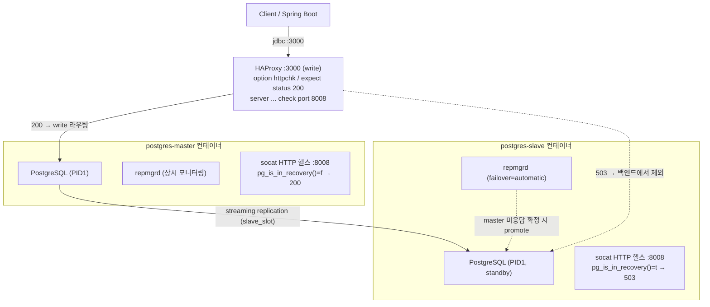
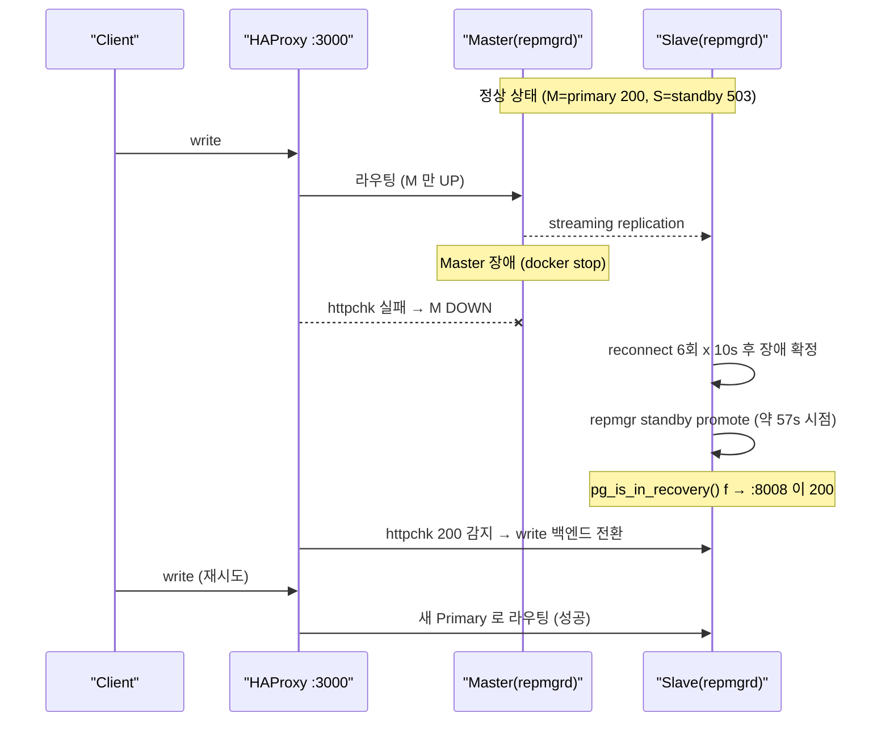

# 자동 Failover 동작화 패치 및 실측 기록

작성일: 2026-06-03
대상: 로컬 학습용 PoC (`postgresql-haproxy`). 운영 배포 대상 아님.

---

## 0) 목적 (Goal)

이전 구성은 README 가 "Master 장애 시 자동 승격"을 주장했지만 실제로는 동작하지 않았다. `docker compose up` 한 번으로 자동 등록 + 자동 failover 가 실제로 일어나도록 고치고, 그 결과를 실측 로그로 남긴다.

## 1) 결론 요약

- `repmgrd` 데몬을 master/slave 양쪽에서 상시 기동하고, 노드 등록을 entrypoint 에서 자동화했다.
- HAProxy write 포트(3000)를 `pg_is_in_recovery()` 기반 HTTP 헬스체크(:8008)로 전환해 "현재 Primary 만 UP" 이 되게 했다.
- 검증 과정에서 이 PoC 가 사실 **복제부터 깨져 있었다**는 점이 드러나 함께 고쳤다 (repmgr 유저 권한, replication slot 미생성).
- 실측: `docker stop postgres-master` 후 **약 57초에 Slave 자동 승격**, 이어 HAProxy write 가 새 Primary 로 자동 전환되어 쓰기 성공.

## 2) 배경 (무엇이 깨져 있었나)

| # | 문제 | 증상 | 영향 |
|---|---|---|---|
| 1 | `repmgrd` 미기동 | `failover='automatic'` 설정만 있고 데몬 없음 | 자동 승격 자체가 일어나지 않음 |
| 2 | HAProxy 헬스체크가 `option pgsql-check` | 연결만 보고 primary/standby 구분 못함 | read-only standby 도 write 백엔드에서 UP |
| 3 | `repmgr` 유저가 비-superuser | `CREATE EXTENSION repmgr` 실패 | 노드 등록/`repmgrd` 전체 무력화 |
| 4 | `slave_slot` 미생성 | standby 가 없는 slot 으로 접속 시도 | streaming 복제 자체가 시작 안 됨 |

3, 4 번은 계획에 없던 잠복 버그였다. 특히 4번 때문에 standby 가 streaming 을 못 받아, primary 에 기록된 노드 레코드가 복제되지 않았고 `repmgrd` 가 자기 메타데이터를 못 찾아 종료됐다.

## 3) 구조 (Design)



핵심: 헬스 판정을 고정 역할이 아니라 런타임 `pg_is_in_recovery()` 로 한다. 그래서 promote 되면 같은 스크립트가 자동으로 200 을 반환하고, HAProxy 가 write 를 새 Primary 로 추종한다.

## 4) 동작 흐름 (Flow)



## 5) 변경 사항 요약

신규 파일
- `docker/postgres/pg-health.sh`: primary 면 200, standby 면 503 반환하는 HTTP 응답기
- `docker/postgres/health-server.sh`: socat 으로 :8008 HTTP 리스너 기동
- `docker/postgres/master/entrypoint.sh`: PostgreSQL 을 PID1 로 두고 백그라운드에서 `primary register` + `repmgrd --daemonize` + 헬스서버
- `docker/postgres/slave/entrypoint.sh`: base backup(+ slot 생성) + `standby register` + 레코드 복제 대기 + `repmgrd` + 헬스서버

수정 파일
- `docker/postgres/master/Dockerfile`, `slave/Dockerfile`: `socat` 설치
- `docker/postgres/repmgr-init-master.sh`: `repmgr` 유저에 `SUPERUSER` 부여 (버그 3)
- `docker/postgres/slave/entrypoint.sh`: `pg_basebackup -C -S slave_slot` (버그 4)
- `docker/postgres/slave/repmgr.conf`: repmgr 5.5 에서 제거된 `retry_promote_interval_secs` 삭제
- `docker/haproxy/haproxy.cfg`: write 백엔드를 `option httpchk` + `check port 8008` 로 전환
- `docker-compose.yml`: master/slave entrypoint 를 wrapper 로 교체 + 스크립트 마운트

## 6) 실측 로그 (실제 docker 실행)

환경: Docker 29.5.2 / Compose v5.1.4 / macOS, PostgreSQL 15 + repmgr 5.5.0.

### 6.1 클러스터 자동 형성 (compose up 한 번)

```
[t=25s] REPL_AND_REPMGRD_READY

 ID | Name            | Role    | Status    | Upstream        | Timeline
----+-----------------+---------+-----------+-----------------+---------
 1  | postgres-master | primary | * running |                 | 1
 2  | postgres-slave  | standby |   running | postgres-master | 1

pg_stat_replication: postgres-slave | streaming | async
replication slot   : slave_slot | active=t
repmgrd            : master(PID 117), slave(PID 138)  ← 양쪽 기동
```

### 6.2 자동 Failover (docker stop postgres-master)

```
=== 사전 HTTP 헬스 ===
master: HTTP/1.1 200 OK              (primary)
slave : HTTP/1.1 503 Service Unavailable  (standby)

=== 사전 HAProxy write(3000) ===
via-haproxy in_recovery=false        (현재 Primary 로 라우팅)
INSERT 0 1                           (before-failover 행)

=== master 중단 후 promote 대기 ===
[t=3s]  slave 아직 standby (in_recovery=t)
... (reconnect 재시도 구간) ...
[t=54s] slave 아직 standby (in_recovery=t)
>>> SLAVE PROMOTED TO PRIMARY at t=57s

=== promote 후 slave HTTP 헬스 ===
slave : HTTP/1.1 200 OK              (503 → 200 자동 전환)

=== HAProxy write(3000) 자동 전환 → 새 Primary 로 INSERT ===
INSERT 0 1
 id |      note       | in_recovery
----+-----------------+-------------
  1 | before-failover | f
 34 | after-failover  | f           (새 Primary 에서 쓰기 성공)
```

promote 직후 `cluster show` 는 죽은 Master 에 대해 `unreachable`, Slave 에 대해 `running as primary (timeline 2)` 를 보고한다. Master 가 내려간 상태이므로 정상적인 경고다.

### 6.3 경고 정리 후 재형성

`slave/repmgr.conf` 는 Dockerfile `COPY` 로 들어가므로 rebuild 후 반영된다. rebuild 뒤 깨끗하게 재기동하면 경고 없이 t=15s 에 클러스터가 자동 형성된다.

```
>>> CLUSTER READY at t=15s
 1  | postgres-master | primary | * running |                 | 1
 2  | postgres-slave  | standby |   running | postgres-master | 1
(WARNING 없음)
```

## 7) 운영 고려 / 튜닝

- **promote 소요시간(약 57초)**: `slave/repmgr.conf` 의 `reconnect_attempts=6` x `reconnect_interval=10` 합(60초)에 지배된다. 더 빠르게 하려면 이 값을 낮춘다. 단 너무 짧으면 일시적 네트워크 끊김에도 불필요하게 승격되는 트레이드오프가 있다.
- **재현 방법**:
  ```bash
  docker compose up -d
  docker exec postgres-master su - postgres -c "repmgr -f /etc/repmgr.conf cluster show"
  docker stop postgres-master    # 약 1분 뒤 slave 자동 승격
  ```
- **HAProxy 확인**: `http://localhost:8080/stats` 에서 write 백엔드는 현재 Primary 1대만 UP 으로 보여야 한다.

## 8) 남는 한계 (1차 패치 시점)

- **구 Master 자동 재합류**: 1차에선 미보장이었으나 → 9.3 에서 자동화 완료(pg_rewind 기반).
- **Keepalived VIP**: → 9.4 에서 실동작화를 시도했으나 로컬 Docker Desktop 비호환으로 롤백.
- **WAL 아카이브 경로 비공유**: master `archive_command` 와 slave `restore_command` 가 같은 로컬 경로를 보지만 공유 볼륨이 없어 아카이브 기반 복구는 동작하지 않는다(streaming 만 유효).

## 9) 후속 개선 (2026-06-03)

### 9.1 promote 시간 단축
`master/slave repmgr.conf` 의 `reconnect_attempts=4 x reconnect_interval=6` + `monitor_interval_secs=5` 로 약 20초에 자동 승격(1차 57초 대비 단축). 더 공격적인 값(3x5, monitor 2)은 promote 시점에 PostgreSQL 을 불안정하게 만들어 메타 갱신 실패를 유발하므로 보수적 값으로 고정했다.

### 9.2 repmgr.conf volume 마운트
`repmgr.conf` 를 Dockerfile `COPY` 에서 docker-compose volume 마운트로 전환해 수정 시 rebuild 가 불필요하다. 단 init 스크립트의 `chown/chmod /etc/repmgr.conf` 는 read-only 마운트와 충돌(`Read-only file system`)하므로 제거했다.

### 9.3 구 Master 자동 재합류
`master/entrypoint.sh` 가 재기동 시 "현재 primary 가 slave 인지" 확인하고, 맞으면 `pg_rewind`(실패 시 base backup)로 새 primary 기준 standby 로 재구성한 뒤 `master_slot` 으로 streaming 합류한다.
- 필수 수정: `slave/pg_hba.conf` 에 `replicator` replication 라인 추가(역전 복제 허용). 이게 없으면 master 가 새 primary 에 attach 하지 못한다.
- 실측: master 재기동 → 약 12초에 standby 로 attach, `cluster show` 경고 없음(master=standby upstream=postgres-slave, slave=primary timeline 2).

### 9.4 HAProxy 이중화 + VIP → 롤백
로컬 Docker Desktop 에서 osixia/keepalived + LinuxKit VM + VRRP 가 비호환이라 VIP 를 잡지 못하고(미할당) 오히려 PostgreSQL 복제를 교란해 crash 루프를 유발하는 것이 격리 검증으로 확정되어 제거했다(reinit: 이중화 129회 vs 단일 0~소수회). write 고가용성은 HAProxy HTTP 헬스체크로 충분하다.
- **교훈**: docker-compose 에서 서비스를 제거할 때는 `docker compose down --remove-orphans` 로 기존 컨테이너를 함께 정리해야 한다. orphan 으로 남은 haproxy-backup 이 단일 HAProxy 검증까지 오염시켜 "단일에서도 crash" 라는 오진을 유발했다.

### 9.5 잔여 한계
`docker stop postgres-master` 는 컨테이너의 docker DNS 레코드까지 제거하므로, promote 순간 slave 의 walreceiver 가 죽은 master 이름을 해석하지 못해 일시적 reinit(약 10여 회)가 발생한다. 자가복구되며 promote/메타갱신/재합류/write 최종 상태는 모두 정상이다. 실제 노드 장애(DNS 유지)에서는 빈도가 낮다.

### 9.6 최종 실측 (단일 HAProxy + 안정 설정)
```
형성 10s → master stop → PROMOTED 20s → META OK(node2=primary) 4s
→ HAProxy:3000 write 성공(in_recovery=false)
→ master 재기동 → REJOINED+ATTACHED 12s
cluster show (경고 없음):
 1 | postgres-master | standby | running | upstream=postgres-slave | timeline 1
 2 | postgres-slave  | primary | * running |                        | timeline 2
```
