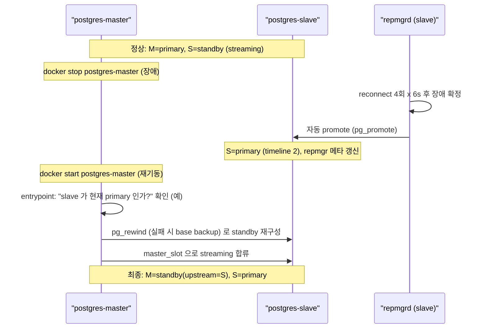

# 01. Failover → 승격 → 구 Master 재합류 전체 사이클

대상: 로컬 학습용 PoC (`postgresql-haproxy`).

## 0) 질문

> master 장애 → slave 승격 → 이전에 장애났던 master 재기동하는 흐름도 정상 동작하는지 테스트됐나?

## 1) 결론

**전체 사이클이 실제 docker 환경에서 검증됐다.** 단 한 가지 핵심 뉘앙스가 있다. **재기동된 구 master 는 primary 로 복귀하지 않고 standby 로 합류**한다. 역할이 뒤집힌 채(slave=primary, master=standby) 안정화되며, 이는 정상적인 repmgr 동작이다.

## 2) 실측 흐름



실측 타임라인(`b5xle0unj`):

```
형성 10s
→ master stop → PROMOTED 20s → 메타 갱신(node2=primary) 4s
→ HAProxy :3000 으로 새 primary 에 write 성공 (in_recovery=false)
→ master 재기동 → 자동 재합류 12s
→ cluster show (경고 없음):
   1 | postgres-master | standby |   running | upstream=postgres-slave | timeline 1
   2 | postgres-slave  | primary | * running |                         | timeline 2
```

## 3) 동작 원리

### 3.1 자동 승격 (promote)
- `slave/repmgr.conf` 의 `failover='automatic'` + 상시 기동된 `repmgrd` 가 upstream(master) 단절을 감지한다.
- `reconnect_attempts(4) x reconnect_interval(6s)` 동안 재접속 시도 후 장애를 확정하고 `pg_promote()` 로 승격한다.
- 승격과 동시에 `repmgr.nodes` 메타데이터가 갱신되어 slave 가 primary 로 기록된다.

### 3.2 자동 재합류 (rejoin)
- `master/entrypoint.sh` 는 컨테이너 재기동 시 데이터가 이미 존재하면(`PG_VERSION` 있음) "현재 클러스터의 primary 가 slave 인지"를 확인한다.
- slave 가 primary 면, 구 master 를 새 primary 기준으로 `pg_rewind`(실패 시 base backup) 하여 standby 로 재구성하고 `master_slot` 으로 streaming 에 합류한다.
- **필수 조건**: `slave/pg_hba.conf` 에 `replicator` 의 replication 허용 라인이 있어야 한다(역전 복제). 이게 없으면 attach 가 거부된다.

## 4) 주의: 자동 복귀(switchback)는 별도

- 자동 failover 는 "slave 를 primary 로 승격"까지만 자동이다.
- 재기동된 구 master 를 **다시 primary 로 되돌리는 것**은 자동이 아니라 계획된 switchover 다.
  ```bash
  # 구 master(현재 standby) 에서 실행하여 역할을 되돌린다 (선택 사항)
  docker exec postgres-master su - postgres -c "repmgr -f /etc/repmgr.conf standby switchover"
  ```
- 운영에서도 보통 "굳이 되돌리지 않고 현재 primary 를 유지"가 권장된다. 노드 이름(master/slave)은 고정 라벨일 뿐, 실제 역할은 repmgr 가 동적으로 관리한다.

## 5) 잔여 한계

`docker stop` 은 컨테이너의 docker DNS 레코드까지 제거하므로, promote 순간 slave 의 walreceiver 가 죽은 master 이름을 해석하지 못해 일시적 reinit(약 10여 회)가 발생한다. 자가복구되며 promote/메타갱신/재합류/write 최종 상태는 모두 정상이다. 실제 노드 장애(프로세스만 죽고 DNS 유지)에서는 빈도가 낮다.

관련 문서: [`AUTOMATIC-FAILOVER.md`](./AUTOMATIC-FAILOVER.md)
