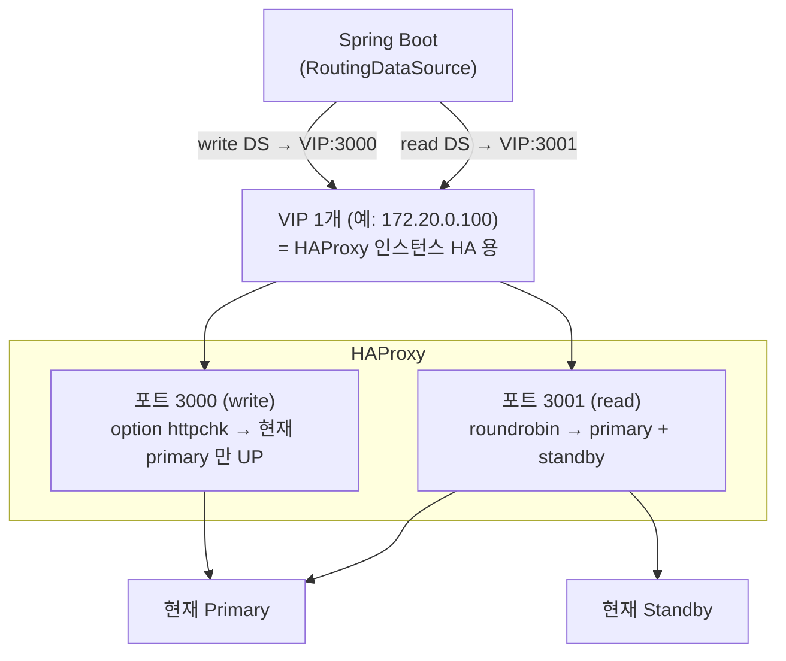

# 02. VIP vs HAProxy 포트: read/write 분리는 어디서 하나

## 0) 질문

> Master/Slave 구조에서 `@Transactional(readOnly)` 에 따라 라우팅한다면, master/slave 각각에 대한 VIP 를 write-vip, read-vip 로 따로 작성해야 하나?

## 1) 결론

**아니다. VIP 는 1개면 충분하고, read/write 구분은 VIP 뒤 HAProxy 의 "포트"(3000/3001)로 한다.** write-vip / read-vip 로 2개를 만들면 둘 다 같은 HAProxy 를 가리키고 포트만 다를 뿐이라 불필요한 중복이다.

## 2) 두 개념은 층이 다르다



| 구분 | 책임 | 목적 |
|---|---|---|
| **VIP** | keepalived 등 | "어느 HAProxy 인스턴스로 갈까" (HAProxy 자체 이중화) |
| **포트 3000/3001** | HAProxy | write / read 진입점 분리 |
| **포트 내 노드 분산** | HAProxy | read pool 분산, write 는 primary 단일 |
| **readOnly → 포트 선택** | 애플리케이션 | `@Transactional(readOnly)` 기반 DataSource 라우팅 |

- **VIP 의 목적은 read/write 구분이 아니라 HAProxy 인스턴스 HA** 다. read/write 와 무관하다.
- read/write 구분은 같은 VIP 의 **포트**로 한다: `VIP:3000`(write), `VIP:3001`(read).

## 3) Spring 설정 (운영에서 VIP 사용 시)

```yaml
spring:
  datasource:
    master:
      jdbc-url: jdbc:postgresql://<VIP>:3000/ramos-test-db   # readOnly=false
      username: ramos
      password: ramostest123
    slave:
      jdbc-url: jdbc:postgresql://<VIP>:3001/ramos-test-db   # readOnly=true
      username: ramos
      password: ramostest123
```

- `@Transactional(readOnly=true)` → read DS(:3001), `false` → write DS(:3000) 로 보내는 라우팅은 **애플리케이션(RoutingDataSource) 책임**이다.
- "그 포트 안에서 어느 물리 노드로 분산할지"(read pool)는 **HAProxy 책임**이다.
- 구체 구현은 [`04-spring-routing-datasource.md`](./04-spring-routing-datasource.md) 참고.

## 4) 현재 PoC 상태

- 이 PoC 는 **VIP 를 롤백**했다(로컬 Docker Desktop 에서 keepalived/VRRP 비호환, 상세는 [`AUTOMATIC-FAILOVER.md`](./AUTOMATIC-FAILOVER.md) §9.4).
- 따라서 현재 진입점은 `localhost:3000`(write) / `localhost:3001`(read), 즉 HAProxy 컨테이너의 포트 매핑이다.
- 운영에서 VIP 가 필요하면 실 노드/별도 L2/macvlan 환경에서 단일 VIP 앞단에 HAProxy 를 두고, 그 VIP 의 3000/3001 포트를 쓰면 된다.

## 5) HAProxy 포트 구성 요약 (`docker/haproxy/haproxy.cfg`)

| 포트 | 용도 | 헬스체크 | 백엔드 |
|---|---|---|---|
| 3000 | write | `option httpchk` (:8008 primary 만 200) | 현재 primary 단일 |
| 3001 | read | `option pgsql-check` | primary + standby (roundrobin) |
| 8080 | stats | - | - |
