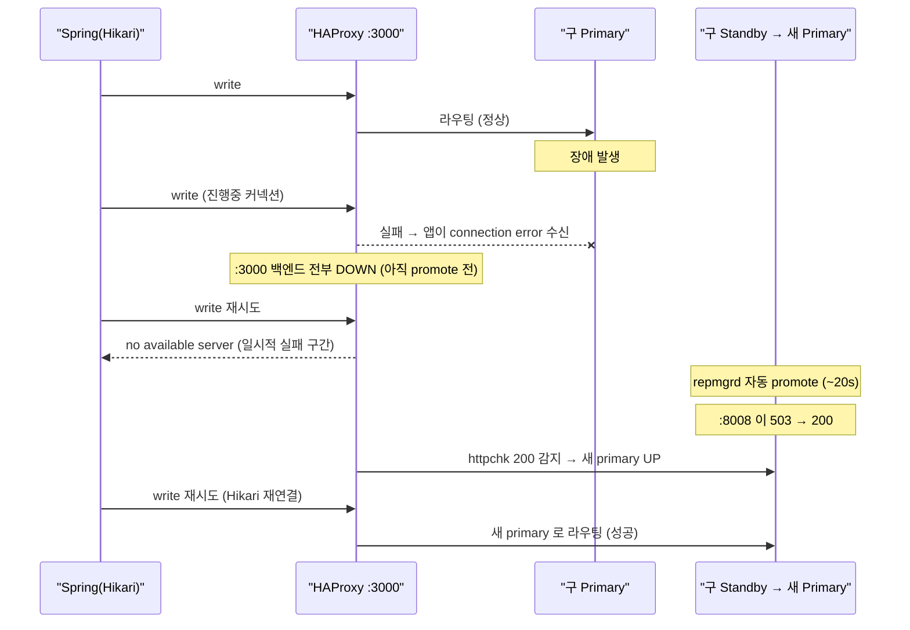

# 03. Failover 시 애플리케이션 관점 동작

## 0) 질문

> primary 장애 후 slave 가 promotion 될 경우, 애플리케이션 입장에선 DB 장애 여부를 모르는 채로 쓰기/읽기 요청 모두 승격된 slave 로 흘러가는가? read pool 은 HAProxy 단에서 처리하는 게 맞는가?

## 1) 결론

- **"무중단"은 아니다. "짧은 중단 후 자동 재라우팅"이다.** promote 와 헬스체크 전환(약 20초+α) 동안 write 요청은 실패하고, 진행 중이던 커넥션/트랜잭션은 끊긴다.
- 전환 완료 후에는 커넥션 풀이 재연결하면서 **앱 코드 변경 없이 자동으로 새 primary 로 라우팅**된다.
- write/read 모두 결국 **승격된 노드(새 primary) 로 수렴**한다(구 master 가 죽어있으므로). 구 master 가 재합류하면 read 는 다시 두 노드로 분산된다.
- **read pool 을 HAProxy 단에서 처리하는 것은 정확한 설계**다.

## 2) 타임라인 (write 요청 기준)

## 3) 단계별 정리

| 구간 | write(:3000) | read(:3001) | 앱 영향 |
|---|---|---|---|
| 정상 | primary 로 | primary+standby 분산 | 정상 |
| 장애 직후 ~ promote 전 | 백엔드 DOWN, 실패 | 죽은 노드 제외, 살아있는 노드로 | **일부 요청 실패** |
| promote 완료 후 | 새 primary 로 | 새 primary 로 (단일) | 재연결 시 정상 복구 |
| 구 master 재합류 후 | 새 primary 로 | 두 노드로 다시 분산 | 정상 |

## 4) "장애를 모른다"의 정확한 의미

- **진행 중이던 커넥션/트랜잭션은 끊긴다.** 앱은 `connection reset` / `no available server` 에러를 받는다. 즉 그 순간 일부 요청은 실패하며, "전혀 모른다"는 아니다.
- promote + 헬스 전환 구간(약 20초) 동안 write 는 불가하다.
- 전환 후 **HikariCP 가 끊긴 커넥션을 폐기하고 새로 연결**하면, 그 연결은 자동으로 새 primary 로 라우팅된다(투명). 이 의미에서 "이후 요청은 새 primary 로 흘러간다"가 맞다.

## 5) 무중단에 가깝게 만드는 보완책

- **애플리케이션 retry**: 멱등한 쓰기/조회에 대해 짧은 backoff 재시도 (예: Spring Retry `@Retryable`).
- **Hikari 튜닝**: `connection-timeout` 을 짧게, `keepalive-time` / `max-lifetime` 로 죽은 커넥션 조기 폐기, `validation-timeout`.
- **connection pooler**: PgBouncer 등을 앞단에 두면 커넥션 재수립 부담을 흡수한다.
- **failover 시간 단축 vs 안정성**: `reconnect_attempts/interval` 을 줄이면 빨라지지만, 너무 공격적이면 일시적 끊김에도 불필요하게 승격되고 promote 시 PostgreSQL 이 불안정해진다(이 PoC 에서 실측, [`AUTOMATIC-FAILOVER.md`](./AUTOMATIC-FAILOVER.md) §9.1).

## 6) read pool 과 복제 지연 주의

- read pool 분산(:3001 roundrobin + weight)은 HAProxy 단 처리가 맞다.
- 단 read 백엔드에 standby 를 넣으면 **복제 지연(replication lag)으로 stale read** 가 가능하다.
- write 직후 같은 데이터를 즉시 read 해야 하는 케이스는 해당 트랜잭션을 `readOnly=false`(primary) 로 두거나, 읽기를 primary 로 강제하는 보완이 필요하다.

관련 문서: [`02-vip-vs-haproxy-port-routing.md`](./02-vip-vs-haproxy-port-routing.md), [`04-spring-routing-datasource.md`](./04-spring-routing-datasource.md)
