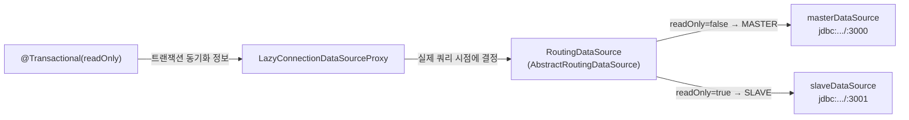

# 04. Spring `AbstractRoutingDataSource` read/write 분리 (Spring Data JPA)

대상: Spring Boot 3.x + Spring Data JPA 기준. HAProxy `:3000`(write) / `:3001`(read) 진입점 가정.

## 0) 목적

`@Transactional(readOnly = true/false)` 값에 따라 write 는 master DataSource(:3000), read 는 slave DataSource(:3001)로 라우팅한다. 애플리케이션은 readOnly 플래그만 신경 쓰고, "어느 물리 노드로 분산할지"는 HAProxy 가 담당한다.

## 1) 구조



핵심: **`LazyConnectionDataSourceProxy` 가 필수**다. 트랜잭션 시작 시점에 커넥션을 즉시 잡으면 readOnly 플래그가 적용되기 전이라 항상 master 로 가버린다. Lazy 프록시는 실제 첫 쿼리 시점에 커넥션을 잡으므로, 그때는 `readOnly` 가 결정되어 라우팅이 올바르게 동작한다.

## 2) 라우팅 키 enum 과 RoutingDataSource

```java
public enum DataSourceType {
    MASTER, SLAVE
}
```

```java
import org.springframework.jdbc.datasource.lookup.AbstractRoutingDataSource;
import org.springframework.transaction.support.TransactionSynchronizationManager;

public class RoutingDataSource extends AbstractRoutingDataSource {

    @Override
    protected Object determineCurrentLookupKey() {
        // 현재 트랜잭션이 readOnly 면 SLAVE, 아니면 MASTER
        boolean readOnly = TransactionSynchronizationManager.isCurrentTransactionReadOnly();
        return readOnly ? DataSourceType.SLAVE : DataSourceType.MASTER;
    }
}
```

## 3) DataSource 설정

```java
import com.zaxxer.hikari.HikariDataSource;
import org.springframework.beans.factory.annotation.Qualifier;
import org.springframework.boot.context.properties.ConfigurationProperties;
import org.springframework.boot.jdbc.DataSourceBuilder;
import org.springframework.context.annotation.Bean;
import org.springframework.context.annotation.Configuration;
import org.springframework.context.annotation.Primary;
import org.springframework.jdbc.datasource.LazyConnectionDataSourceProxy;

import javax.sql.DataSource;
import java.util.HashMap;
import java.util.Map;

@Configuration
public class DataSourceConfig {

    @Bean
    @ConfigurationProperties("spring.datasource.master")
    public DataSource masterDataSource() {
        return DataSourceBuilder.create().type(HikariDataSource.class).build();
    }

    @Bean
    @ConfigurationProperties("spring.datasource.slave")
    public DataSource slaveDataSource() {
        return DataSourceBuilder.create().type(HikariDataSource.class).build();
    }

    @Bean
    public DataSource routingDataSource(
            @Qualifier("masterDataSource") DataSource masterDataSource,
            @Qualifier("slaveDataSource") DataSource slaveDataSource) {

        RoutingDataSource routing = new RoutingDataSource();
        Map<Object, Object> targets = new HashMap<>();
        targets.put(DataSourceType.MASTER, masterDataSource);
        targets.put(DataSourceType.SLAVE, slaveDataSource);

        routing.setTargetDataSources(targets);
        routing.setDefaultTargetDataSource(masterDataSource); // 트랜잭션 없으면 master
        return routing;
    }

    @Bean
    @Primary
    public DataSource dataSource(@Qualifier("routingDataSource") DataSource routingDataSource) {
        // Lazy 프록시로 감싸야 readOnly 플래그가 라우팅에 반영된다 (필수)
        return new LazyConnectionDataSourceProxy(routingDataSource);
    }
}
```

## 4) application.yml

```yaml
spring:
  datasource:
    master:
      jdbc-url: jdbc:postgresql://localhost:3000/ramos-test-db?currentSchema=ramos-test-db
      username: ramos
      password: ramostest123
      hikari:
        maximum-pool-size: 20
        connection-timeout: 3000      # failover 구간에서 빨리 실패하도록 짧게
        keepalive-time: 30000
        max-lifetime: 1800000
        validation-timeout: 2000
    slave:
      jdbc-url: jdbc:postgresql://localhost:3001/ramos-test-db?currentSchema=ramos-test-db
      username: ramos
      password: ramostest123
      hikari:
        read-only: true               # 슬레이브 풀은 read-only 로 명시
        maximum-pool-size: 30
        connection-timeout: 3000
  jpa:
    hibernate:
      ddl-auto: validate
    open-in-view: false               # 뷰 렌더링까지 커넥션 점유 방지 (라우팅 정확도/풀 효율)
    properties:
      hibernate:
        format_sql: true
```

> `DataSourceBuilder` 가 `jdbc-url` 키를 인식하도록 `url` 이 아니라 `jdbc-url` 을 사용한다(HikariDataSource 기준).

## 5) 사용 예 (Service 계층)

```java
@Service
@RequiredArgsConstructor
public class MemberService {

    private final MemberRepository memberRepository;

    // 쓰기: MASTER(:3000) 로 라우팅
    @Transactional
    public Long register(MemberCreateRequest request) {
        return memberRepository.save(request.toEntity()).getId();
    }

    // 읽기: SLAVE(:3001) 로 라우팅
    @Transactional(readOnly = true)
    public MemberResponse findById(Long id) {
        return memberRepository.findById(id)
                .map(MemberResponse::from)
                .orElseThrow(() -> new MemberNotFoundException(id));
    }
}
```

## 6) 주의사항

- **`@Transactional` 이 없으면** `determineCurrentLookupKey()` 가 readOnly=false 로 판단해 기본 MASTER 로 간다. 읽기 메서드에도 `@Transactional(readOnly = true)` 를 명시해야 slave 로 분산된다.
- **readOnly=true 트랜잭션 안에서 write 금지**: slave 는 read-only standby 이므로 INSERT/UPDATE 시 `cannot execute ... in a read-only transaction` 으로 실패한다.
- **복제 지연(stale read)**: write 직후 같은 데이터를 readOnly 로 읽으면 slave 반영 전일 수 있다. 최신성이 필요한 읽기는 `readOnly=false`(master) 로 둔다.
- **failover 와의 관계**: master 장애로 slave 가 primary 로 승격되면, slave DataSource(:3001)도 HAProxy 가 새 primary 로 보내므로 read 는 계속 동작한다. write DataSource(:3000)도 httpchk 로 새 primary 를 따라간다. 단 promote 전환 구간(약 20초)에는 write 가 실패할 수 있으므로 retry 를 둔다([`03-failover-application-perspective.md`](./03-failover-application-perspective.md)).
- **트랜잭션 전파 주의**: 외부 트랜잭션이 readOnly=false 인 상태에서 내부 readOnly=true 메서드를 호출하면, 같은 트랜잭션을 재사용(`REQUIRED`)하므로 MASTER 로 간다. 읽기 분산이 필요하면 호출 구조나 전파 속성을 설계해야 한다.

관련 문서: [`02-vip-vs-haproxy-port-routing.md`](./02-vip-vs-haproxy-port-routing.md), [`03-failover-application-perspective.md`](./03-failover-application-perspective.md)
