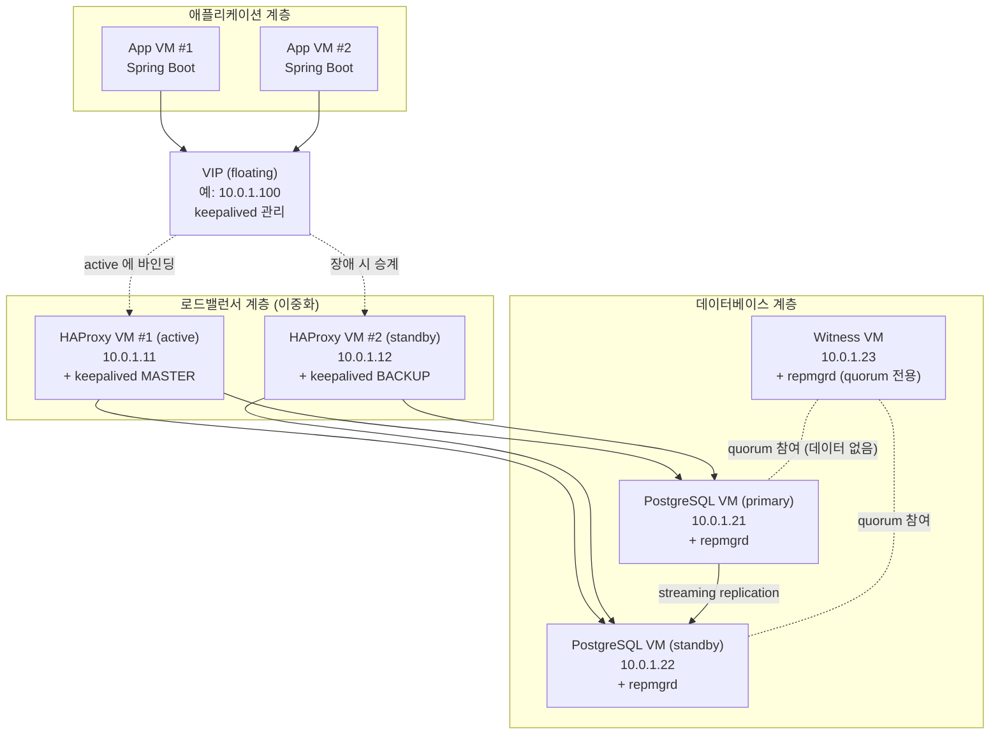
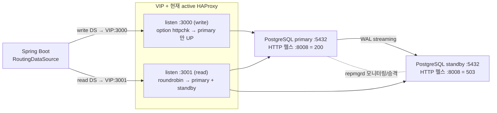

# 05. 운영(VM 기반) 전체 논리/물리 구성도

대상: 온프렘 VM(또는 IaaS 인스턴스)에 PostgreSQL/HAProxy 를 직접 설치하는 운영 구성. 로컬 docker compose PoC 의 운영 확장판.

## 0) 질문

> 운영 DB 를 VM 각각 셋팅하고 PostgreSQL 설치(apt 또는 docker), VM 간 네트워크 설정, HAProxy VM 셋업 기반으로 간다면, 애플리케이션이 기재할 VIP 는 단일인가? 포트만 master/slave 다르게?

## 1) 결론

- **애플리케이션이 기재할 VIP 는 단일이다.** `VIP:3000`(write), `VIP:3001`(read). read/write 구분은 포트로 한다.
- VIP 는 **HAProxy 이중화(active/standby) 를 위한 floating IP** 다(keepalived 가 관리). read/write 구분용이 아니다.
- 로컬 Docker Desktop 과 달리 **실 VM 의 L2 네트워크에서는 VRRP/VIP 가 정상 동작**하므로 운영에서는 VIP 를 쓸 수 있고 권장된다.
- 운영에서는 로컬 PoC 에 없던 **witness 노드(split-brain 방지)** 가 사실상 필수다.

## 2) 물리 구성도 (VM 토폴로지)



## 3) 논리 구성도 (트래픽/제어 흐름)



## 4) 노드 구성 (예시)

| VM | 역할 | 예시 IP | 설치 | 주요 포트 |
|---|---|---|---|---|
| app-1/2 | 애플리케이션 | 10.0.1.31~ | Spring Boot | - |
| haproxy-1 | LB active + keepalived MASTER | 10.0.1.11 | HAProxy, keepalived | 3000,3001,8080 |
| haproxy-2 | LB standby + keepalived BACKUP | 10.0.1.12 | HAProxy, keepalived | 3000,3001,8080 |
| pg-primary | PostgreSQL primary | 10.0.1.21 | postgresql-15, repmgr | 5432, 8008(헬스) |
| pg-standby | PostgreSQL standby | 10.0.1.22 | postgresql-15, repmgr | 5432, 8008(헬스) |
| pg-witness | repmgr witness (quorum) | 10.0.1.23 | postgresql-15, repmgr | 5432 |
| - | VIP (floating) | 10.0.1.100 | keepalived 가 부여 | 3000,3001 |

> 최소 구성은 primary + standby + witness 의 3 DB 노드 + HAProxy 2 노드다. witness 는 데이터를 갖지 않는 가벼운 PostgreSQL 인스턴스로, 2 노드만 있을 때의 split-brain 을 방지한다.

## 5) 네트워크 / 방화벽 (열어야 할 포트)

| 출발 | 도착 | 포트 / 프로토콜 | 용도 |
|---|---|---|---|
| App | VIP | 3000, 3001 (TCP) | write / read 진입 |
| HAProxy | PostgreSQL | 5432 (TCP) | 트래픽 라우팅, pgsql-check |
| HAProxy | PostgreSQL | 8008 (TCP/HTTP) | primary 판정 헬스체크 |
| 운영자 | HAProxy | 8080 (TCP/HTTP) | stats 대시보드 |
| PostgreSQL | PostgreSQL | 5432 (TCP) | streaming replication, repmgrd |
| Witness | PostgreSQL | 5432 (TCP) | repmgr quorum |
| keepalived | keepalived | VRRP (IP proto 112) 또는 unicast | VIP 협상 |

주의:
- keepalived VRRP 는 기본 멀티캐스트(224.0.0.18). 멀티캐스트가 막힌 망에서는 `unicast_peer` 로 유니캐스트 설정한다.
- HAProxy 2 대와 PostgreSQL/VIP 는 **같은 L2 서브넷**에 두는 것이 VRRP 동작에 가장 단순하다.
- 클라우드(AWS/GCP)에서는 VRRP 가 막히는 경우가 많아 **VIP 대신 L4 LB(NLB) 또는 클라우드 floating IP API** 를 쓴다(아래 §8).

## 6) repmgr witness (split-brain 방지)

- 2 노드(primary + standby)만 있으면, 네트워크 분단 시 standby 가 "primary 가 죽었다"고 오판해 승격하면서 양쪽 primary(split-brain)가 될 수 있다.
- witness 노드를 두면 repmgrd 가 **과반(quorum)** 으로 장애를 판정하므로, 소수 측은 승격하지 않는다.
- witness 는 별도 VM 에 가벼운 PostgreSQL + `repmgr witness register` 로 등록한다(데이터 복제 없음).
- 추가로 `repmgr.conf` 에 fencing(예: `promote_command` 전 구 primary 차단)이나 `location` 기반 정책을 둬서 안전성을 높인다.

## 7) HAProxy 이중화 + keepalived VIP (운영에서 동작하는 이유)

- 로컬 Docker Desktop 에서는 LinuxKit VM + osixia keepalived 조합이 VRRP 를 제대로 처리하지 못해 VIP 가 안 잡혔다([`AUTOMATIC-FAILOVER.md`](./AUTOMATIC-FAILOVER.md) §9.4).
- 실 VM 의 물리/가상 L2 네트워크에서는 keepalived 가 `gratuitous ARP` 로 VIP 를 active HAProxy 의 NIC 에 정상 바인딩한다.
- active HAProxy 가 죽으면 keepalived 가 VIP 를 standby HAProxy 로 넘기고(VRRP priority + track_script), 애플리케이션은 같은 VIP 로 계속 접속한다.
- 즉 운영에서는 **VIP = HAProxy 이중화의 단일 진입점**으로 정상 동작하며, 애플리케이션 설정(VIP:3000 / VIP:3001)은 바뀌지 않는다.

## 8) 애플리케이션 접속 (단일 VIP + 포트)

```yaml
spring:
  datasource:
    master:
      jdbc-url: jdbc:postgresql://10.0.1.100:3000/appdb   # write, readOnly=false
    slave:
      jdbc-url: jdbc:postgresql://10.0.1.100:3001/appdb   # read,  readOnly=true
```

- 단일 VIP(`10.0.1.100`) + 포트(3000/3001)로 충분하다.
- 라우팅 구현은 [`04-spring-routing-datasource.md`](./04-spring-routing-datasource.md) 와 동일하다.
- **클라우드의 경우**: VIP 자리에 NLB DNS 를 둔다. write 는 `nlb-write:3000`(또는 별도 리스너), read 는 `nlb-read:3001`. 클라우드에서는 read 가 많아지면 read 전용 LB 를 분리하기도 한다.

## 9) 로컬 PoC 와의 핵심 차이

| 항목 | 로컬 docker compose PoC | 운영 VM |
|---|---|---|
| 노드 격리 | 컨테이너 (같은 docker bridge) | 독립 VM (독립 OS/NIC) |
| VIP | 비활성(롤백, Docker Desktop 비호환) | keepalived VIP 정상 동작 |
| HAProxy | 단일 | 2 대 이중화 + VIP |
| split-brain 방지 | 없음(2 노드) | witness 노드 + quorum |
| WAL 아카이브 | 미구성(streaming 만) | 공유 스토리지/pgBackRest 등 |
| 장애 시뮬레이션 | `docker stop`(DNS 까지 제거) | 프로세스/노드 다운(DNS 유지) |
| 모니터링 | HAProxy stats, pgAdmin | Prometheus(postgres_exporter, haproxy_exporter), 알림 |

## 10) 운영 체크리스트

- [ ] DB 3 노드(primary/standby/witness) + HAProxy 2 노드 + keepalived VIP 구성
- [ ] 같은 L2 서브넷 또는 VRRP unicast 설정, 방화벽 포트(§5) 개방
- [ ] PostgreSQL: `wal_level=replica`, `max_wal_senders`, replication slot, `wal_log_hints=on`(pg_rewind 용)
- [ ] repmgr: 모든 노드 등록(primary/standby/witness register), `repmgrd` 상시 기동(systemd)
- [ ] HAProxy: write(:3000) httpchk + read(:3001) 분산, 각 PostgreSQL 노드에 primary 판정 헬스(:8008) 데몬
- [ ] keepalived: track_script 로 자기 HAProxy 감시, VIP 우선순위 설정
- [ ] WAL 아카이브/백업(pgBackRest 등) + PITR 전략
- [ ] 모니터링/알림(복제 지연, 노드 상태, VIP 위치, failover 이벤트)
- [ ] 구 primary 재합류 절차(node rejoin/switchover)와 fencing 검증
- [ ] 애플리케이션 retry + Hikari 타임아웃 튜닝([`03-failover-application-perspective.md`](./03-failover-application-perspective.md))

관련 문서: [`02-vip-vs-haproxy-port-routing.md`](./02-vip-vs-haproxy-port-routing.md), [`03-failover-application-perspective.md`](./03-failover-application-perspective.md), [`04-spring-routing-datasource.md`](./04-spring-routing-datasource.md)
